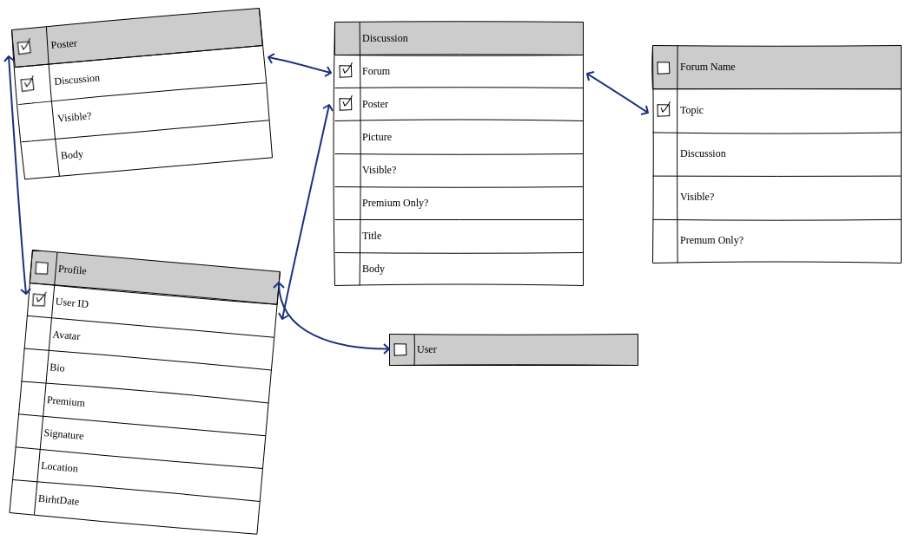
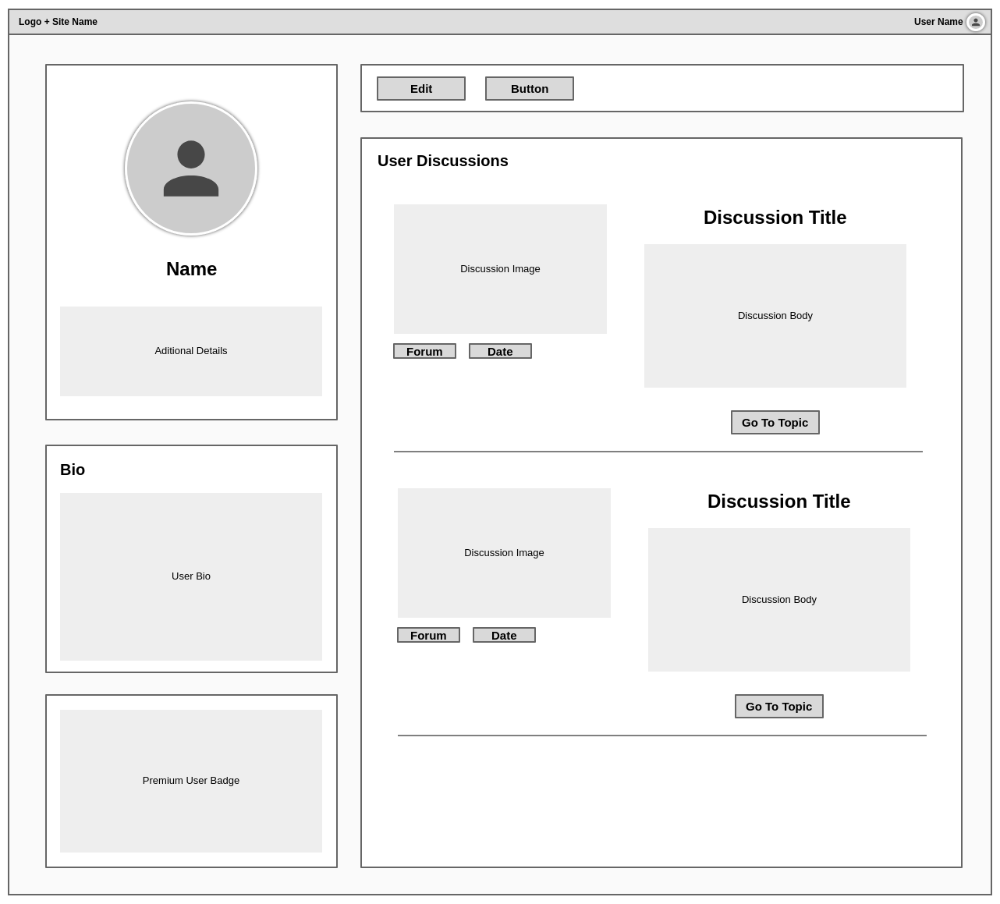
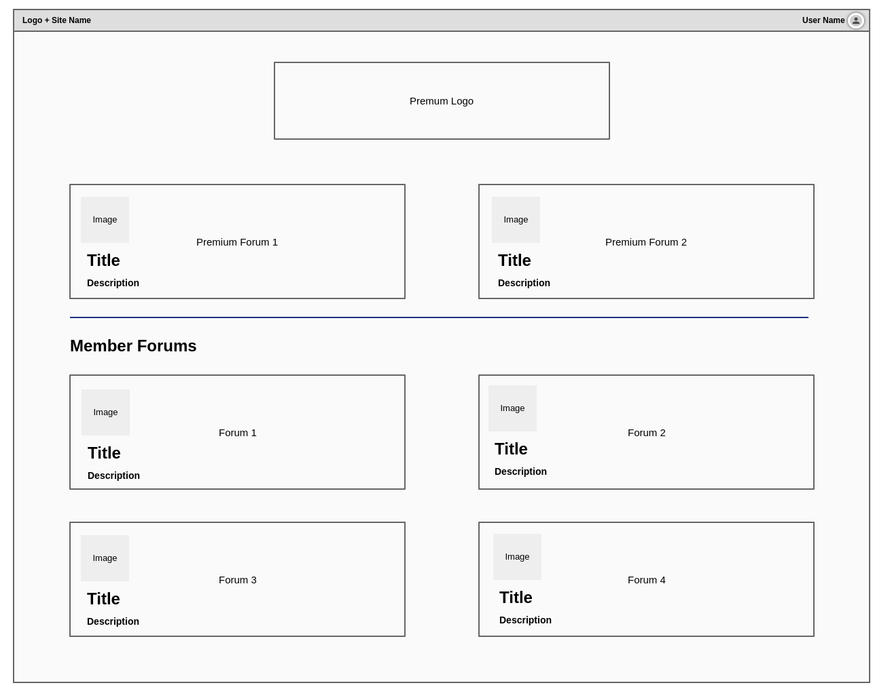

Milestone 4 submission for [Code Insitute](https://codeinstitute.net)

---

<br><br>


# World Forums, let's share together!
<br><br>

# About
World Forums is a forum application (app) that includes a customizable personal profile and the possibility to upgrade accounts to premium status, unlocking a premium badge and a premium-only forum section. This is done via an one-time stripe payment.


## The Project
I created this app for the Full Stack Framework project of [**_Code Institute's_**](https://codeinstitute.net/) Full Stack Software Development course. I have decided to create a forum with monetization option, as this would require an interesting database model as a forum discussion post not only requires the forum as the foreign key, but as well the user that would create the discussion.

The project uses HTML, CSS, Javascript as the front-end display and functionality, including a framework called [Material Design for Bootstrap](https://mdbootstrap.com/) for additional styling. For the backend functionality, the project utilizes Python and the Django framework, SQLite3 and PostgreSQL. 


## Preview
Click to open in a new window<br>
<a href="./documentation/media/preview2.png" target="_blank"></a>
<a href="./documentation/media/preview1.png" target="_blank"></a>
<a href="./documentation/media/preview3.png" target="_blank"></a>
<a href="./documentation/media/preview4.png" target="_blank"></a>

<br>

## Main URLs are (example with host):
- https://django-test-world-forums.herokuapp.com/ (Main application)
- https://django-test-world-forums.herokuapp.com/admin/ (Admin Portal)


## Database Diagram
As a discussion post needs to be traced back to the user that created it and as well the section where this post was created, I've designed the database schema to have some tables with two foreign keys. As an example ...
- A comment within a discussion post will need to link back to its creator and belong to a discussion post
- A discussion post will need to link back to its creator and belong to a forum
- If the administrator decides to delete an user or a discussion post, the respective discussions and comments within would need to be traceable and deleted as well (cascade mode)
<br><br>
Note: An separate table has been also created for payment information only

## Features
- **Navbar** will adjust from Login & Sign up to the user's avatar and name based on login status
- **Flash Messages** will display at the top of the page but below of the navbar if required.
- **User Registration** will require users to provide a valid email address to receive an email with activation link. It will also require an username that will be the main identifier for the account. 
- **Login** will require the Username & Password and have the email confirmed.
- **Logout** - Allows end users to logout of their account by clicking the 'Logout' link in the navbar/sidenav. Upon clicking the button, the user session ends.
- **Profile Page** of an user can be accessed without having to login. This page will display their avatar, additional details, Bio and discussions they have created. From there, you can directly jump into a discussion or the relevant forum. The email address field will only be visible if the user is logged in.
- **Edit Profile** allows users to edit their own profile in a separate page. The user will be able to upload a new avatar, add additional details like First Name, Last Name, Location, Date of Birth and a Biography.
- **Change Password** button can be found within your Profile Edit page. The user will be asked to type the new password twice for extra precaution
- **Premium Profile** will grant the user a "World Forums Concierge" badge in their profile, as well as access to Concierge only member forum. This can be purchased via an one-time Stripe Payment.
- **Forum Overview Page** is the site's main homepage. It will show all forums created by the site owner. Concierge forum section will only display for Concierge users
- **Forum Page** will list discussions created within the forum. If an user is logged in, a button to create a new discussion post is also visible. Post date and a link to the creator's profile is also listed.
- **Discussion Page** will show the content created (Image, Title, Body, Initiator, Forum and creation date). It will also list and allow users to post comments in rich-text format. If the owner visits his own discussion, an additional button for edit is displayed.
- **Edit Discussion Page** allows the owner to update its discussion (Image, Title, Body) or delete the post. Clicking on "Delete" will show a modal, warning the user that the action will delete the discussion and the comments permanently.
- **Image Uploads** are stored in Amazon Web Services for extra security
- **Admin Portal** allows the site owner and admins to update the payment information (Product Name, Price), edit/delete/create users, forums, posts, comments, etc. This is a very powerful tool and should be kept secure at all time!

<br>

# UX
For this project, I've adopted the methodology of the five planes of UX, which consist of:
- Strategy / User Stories
- Scope
- Structure
- Skeleton
- Surface Design
> “The Elements of User Experience” book written by Jesse James Garrett, one of the founders of Adaptive Path, a user experience consultancy based in San Francisco.


## Strategy / User Stories
As the owner, I want to:
1. ... offer a place where I can publicly share interesting stories/news/ideas
2. ... allow other users to participate with their ideas or share their opinion and feedback on my stories
3. ... allow users to register on my site to actively participate in our discussions but keep read-only open to unregistered users
4. ... be able to create forums so that discussions can be organized within them
5. ... offer a free service but also be able to monetize for exclusive member only content

As an End User or site consumer, I want to:
1. ... view topics as a guest
2. ... register for my own account
3. ... customize my profile with a bio and profile picture 
4. ... create my own discussions
5. ... edit my own discussions that I've created
6. ... add comments to mine and other discussions
7. ... have an exclusive forum section for premium only


## Scope of this Project (based on owner and end user requirement/stories)
- To create an application that is accessible on mobile, tablet, laptops and desktops and is easy to navigate
- To create a website with uncluttered, logical and intuitive navigation which is easy to follow
- To store, manipulate, edit and delete (CRUD) data in a secure database (Postgres for production and SQLite3 for development)
- To create a monetization strategy for exclusive member access
- To create an app (website) written with Django framework, ready to be deployed to Heroku


## Structure
- Forum Page (Mobile first approach)
  - Top:
    - A navigation bar with Title and a "hamburger" menu if accessed by small screen devices. This menu will allow the user to visit their profile and login/logout
  - Central:
    - Forums are displayed as large boxes for intuitive navigation
    - "Concierge" Premium Forums are displayed first if user is part of the club
  - Bottom:
    Simple footer displaying Copyright and Credit of the app creator

- Discussion List Page (Mobile first approach)
  - Top:
    - A navigation bar with Title and a "hamburger" menu if accessed by small screen devices. This menu will allow the user to visit their profile and login/logout
  - Central:
    - Discussion Name and Description at the top, including a "Create new Post" button for logged users
    - List of all Discussion posts below, including the Title, the discussion body, link to it's creator and button to "view" the discussion
  - Footer:
    - Footer will display the Copyright and the credits for the app creator

- Discussion View Page (Mobile first approach)
  - Top:
    - A navigation bar with Title and a "hamburger" menu if accessed by small screen devices. This menu will allow the user to visit their profile and login/logout
  - Central:
    - Discussion picture on top, followed by the Title and the actual discussion post
    - At the end of the post, additional details like link to post creator, link to it's belonging forum and date of the post will be shown
    - If the logged user is also the creator, he may edit the post via button that appears at the end
  - Footer:
    - Footer will display the Copyright and the credits for the app creator


## Skeleton
To be adhered to the structure outlined above, the following wireframes were drafted:
- User Profile  
  
- Forum Overview  
  
- Discussion Overview  
  


## Surface Design
To distinguish from other popular forum platforms, I've selected a color scheme that is opposite to the standard of blue and, hopefully, pleasant to look at:
- Main Colour (buttons & titles): <span style="color:#F3F0F1;background-color:#990011FF;"> #990011FF</span>
- Main background:<span style="color:black;background-color:#FCF6F5FF;">#FCF6F5FF</span>
- Logo for the project: 

<br>

# Testing

I have separated the testing details into a separate [Testing Documentation](./documentation/development.md).

<br>

# Deployment

### Demo
- Application can be found at https://django-test-world-forums.herokuapp.com/.

<br>

### Requirements

- A host capable to run python3 applications and PIP3, with internet access
  - Example: https://www.heroku.com/


### Steps for dependencies

- Stripe
  1. Create a Stripe account and in your dashboard, navigate to Products, then click on [+ Add Product](https://dashboard.stripe.com/test/products/create)
  2. Create your Product with the desired price and not down the following details: ```ID``` & ```Price ID```
  3. In your dashboard, click on "Developers" and select "Webhooks" from the left menu.
  4. Here, click on "+ Add endpoint" and enter your app's ```Endpoint URL``` and a short description
  5. Once created, select that endpoint and click on ```Reveal``` of your Signing Secret section. Note this ID as you will require it later

- Amazon AWS
  1. Create an Amazon AWS account and login into it
  2. Create an S3 bucket by following [these steps.](https://docs.aws.amazon.com/AmazonS3/latest/userguide/creating-bucket.html)
  3. Follow [this guide](https://docs.aws.amazon.com/AmazonS3/latest/userguide/HostingWebsiteOnS3Setup.html) to configure your AWS S3 bucket for static website hosting
  4. In your CORS settings, add the following:
    ~~~
    [
    {
        "AllowedHeaders": [
            "Authorization"
        ],
        "AllowedMethods": [
            "GET"
        ],
        "AllowedOrigins": [
            "*"
        ],
        "ExposeHeaders": []
    }
    ]
    ~~~
  5. Before following [this guide](https://docs.aws.amazon.com/AmazonS3/latest/userguide/walkthrough1.html) to create an IAM user, give control access over the bucket, make sure you download the CSV file with your secret IDs during the user creation!

### Steps for Application Server
- Heroku
  1. [Review official documentation for steps](https://devcenter.heroku.com/articles/getting-started-with-python)
  2. Create a Postgres database and note the URL you will need for your environment variables
  2. Add the necessary environment variables to Heroku
     1. Go to Heroku Settings Tab
     2. Click Reveal Config Vars and populate with the following values:

|Key | Value |
|:---|:---|
|SECRET_KEY | (New Django Secret Key generated at https://djecrety.ir/) |
|HEROKU_HOSTNAME | (From Heroku, this is your app URL) |
|DATABASE_URL| (From Heroku, the URL for your database) |
|USE_AWS | True |
|AWS_ACCESS_KEY_ID | (From AWS, this is in your downloaded CSV file) |
|AWS_ACCESS_SECRET_KEY_ID | (From AWS, this is in your downloaded CSV file) |
|STRIPE_ENDPOINT_SECRET | From Stripe, these can be found by following [this guide](https://support.stripe.com/questions/locate-api-keys-in-the-dashboard) |
|STRIPE_PUBLIC_KEY | From Stripe, these can be found by following [this guide](https://support.stripe.com/questions/locate-api-keys-in-the-dashboard)  |
|STRIPE_SECRET_KEY | From Stripe, these can be found by following [this guide](https://support.stripe.com/questions/locate-api-keys-in-the-dashboard)  |
|STRIPE_WH_SECRET | (From Stripe, this is the Webhook Secret you've noted earlier) |
|EMAIL_HOST_USER | (From Google, a GMail account you would like to use to send emails from) |
|EMAIL_HOST_PASS | (App Password for the same Gmail account by following [this guide.](https://support.google.com/accounts/answer/185833)) |

### Application

  4. Post deployment setup requires you to download and execute [Heroku CLI](https://devcenter.heroku.com/articles/heroku-cli#download-and-install).
  5. In your Heroku CLI, run the following commands:
  ~~~bash
  heroku run python3 manage.py migrate
  ~~~
  6. Then create a super user with the following command and not the username and password:
  ~~~bash
  heroku run python manage.py createsuperuser
  ~~~
  7. Run the app in Heroku and navigate to the admin pannel, usually found by appending ```/admin/``` to your URL
  8. Next to "Products", click on "Add".
  9. Add a name for your premium forum access and enter your "Stripe Product ID" you've noted earlier.
  10. On the same page under Prices, click "Add another Price" and add the Price ID you've created earlier + the actual price (example 10€ would be ```1000```)
  11. All steps are done for deployment.

#### Alternative deployment (Directly to Linux Server)
  1. You may deploy the repo locally. The follow instructions below are for a Linux machine
  2. Create a folder where you want the App to reside and navigate to it in your command line
  3. Clone the App from GitHub:
  ```bash
  git init
  git clone https://github.com/patrickpulfer/code_insitute_m4.git .
  ```
  4. Create an environment variable file called .env and add the variables advised above.
  5. Install dependencies with PIP3:
  ```bash
  pip3 install -r requirements.txt
  ```
  6. Run the initial setup for the database:
  ```bash
  python3 manage.py migrate
  ```
  7. Run the App
  ```bash
  python3 manage.py runserver
  ```
  Note: If you plan to deploy as an actual production server on Linux, you may want to look into [WSGI](https://wsgi.readthedocs.io/en/latest/what.html), [Gunicorn](https://gunicorn.org/) and a proper web server like NGINX.
  
<br>

# Credits

## Technologies Used
This application has been built by using the following technologies:

- <a href="https://www.djangoproject.com/"></a>
    - Django is a high-level Python web framework that encourages rapid development and clean, pragmatic design.

- <a href="https://stripe.com/en-ie/payments"></a>
    - A complete payments platform, engineered for growth

- <a href="https://www.python.org/"></a>
    - Python is a programming language that lets you work quickly and integrate systems more effectively.

- <a href="https://www.djangoproject.com/"></a>
    - [HTML 5](https://www.w3.org/TR/2008/WD-html5-20080122/) / [CSS](https://www.w3.org/Style/CSS/Overview.en.html) / [JavaScript](https://262.ecma-international.org/10.0/index.html)
- [JQuery](https://jquery.com)
  - Simplified DOM manipulation.
- [Font Awesome](https://fontawesome.com/)
  - Iconic SVG, font, and CSS framework.
- [Bootstrap](https://getbootstrap.com/)
  - Front-end framework for web development.
- [Material Design for Bootstrap](https://mdbootstrap.com/)
  - The most popular UI KIT for building responsive, mobile-first websites and apps - free for personal & commercial use
- Python Packages:
    - [Gunicorn](https://pypi.org/project/gunicorn/), [Pillow](https://pypi.org/project/Pillow/), [psycopg2](https://pypi.org/project/psycopg2/), [boto3](https://pypi.org/project/boto3/), [s3transfer](https://pypi.org/project/s3transfer/), [django-allauth](https://github.com/pennersr/django-allauth), [ckeditor](https://ckeditor.com/) - see [requirements.txt](https://github.com/patrickpulfer/Code-Institute-M4/blob/main/requirements.txt) for full list!


### Media
- The default Post/Discussion picture that appear if you don't supply your own is sourced from [Pexels](https://www.pexels.com/photo/beach-bottle-cold-daylight-292426/) and is free to use. (I just fell in love with this wallpaper!)
- The Logo has been created in [Placeit](https://placeit.net/), a branding service I've used in the past


### Acknowledgements
- I would like to thank [Code Institute](https://codeinstitute.net/) for the learning experience and all the support provided.
- I would also like to thank my wife for her idea suggestion
- This is my first application written in Python with Django framework. The usual applies (might not be the most efficient code out there)
