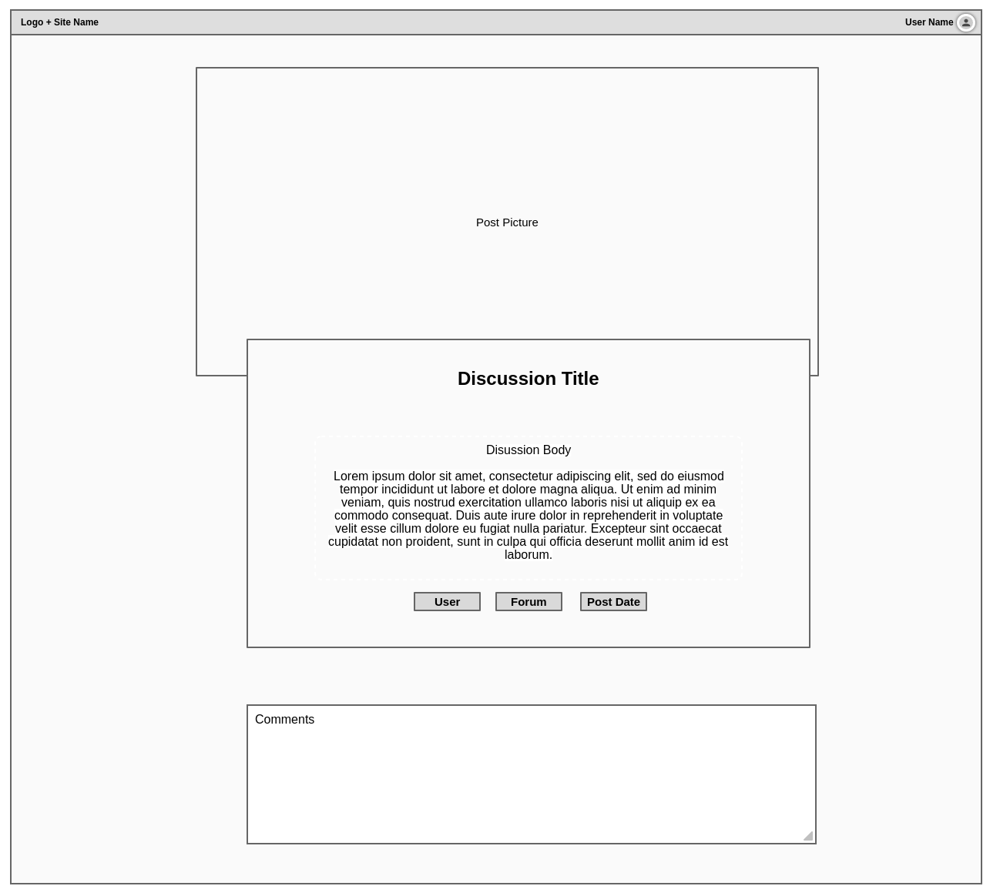

## Project Requirements for Code Institute Full-Stack Software Development Diploma

## Full Stack Frameworks with Django Milestone Project
- Build a full-stack site based around business logic used to control a centrally-owned dataset.
- Set up an authentication mechanism and provide paid access to the site's data and/or other activities based on the dataset, such as the purchase of a product/service.
- Setup a e-commerce functionality by using Stripe payments
   

## My approach

- I have taken inspiration from a real-life website called [Reddit](https://www.reddit.com/) where users can share ideas and discuss these ideas in a "forum"-style manner.

- In this document, I will attempt to explain the process I went through in thinking, planning and developing this project by utilizing industry-standard methodologies.

 

# UX Design

 
For this project, I've adopted the methodology of the five planes of UX, which consist of:

- Strategy
- Scope
- Structure
- Skeleton
- Surface Design

> “The Elements of User Experience” book written by Jesse James Garrett, one of the founders of Adaptive Path, a user experience consultancy based in San Francisco.

 

## Strategy

### User Stories & Requirements

- Owner, Administrator:
    1. I want to offer a place where I can publicly share interesting stories/news/ideas
    2. I want other users to participate with ideas or share their opinion on my stories
    3. I want to offer a free service but also be able to monetize for exclusive member only content
    4. I want to customize my profile to include a short "Who am I" and ideally a profile picture

- End Users, site consumers:
    1. I want to share my ideas/opinions and have other users like me participate in the conversation
    2. I want to read other user's ideas and be able to participate in their conversation
    3. I want to at least read other user's ideas without having to login
    4. I want to have an exclusive club access, even if have to pay for it!
    5. I want to clutter or distraction, an intuitive forum that works on my PC, tablet and Phone

 

### Scope of this Project (based on owner and end user requirement/stories)

- To create an application that is accessible on mobile, tablet, laptops and desktops and is easy to navigate
- To create a website with uncluttered, logical and intuitive navigation which is easy to follow
- To store, manipulate, edit and delete (CRUD) data in a secure database, in this case Postgres
- To create a monetization strategy for exclusive member access
- To create an app (website) written with Django framework, ready to be deployed to Heroku

 

### Structure

- Forum Page (Mobile first approach)
  - Top:
    - A navigation bar with Title and a "hamburger" menu if accessed by small screen devices. This menu will allow the user to visit their profile and login/logout
  - Central:
    - Forums are displayed as large boxes for intuitive navigation
    - "Concierge" Premium Forums are displayed first if user is part of the club
  - Bottom:
    Simple footer displaying Copyright and Credit of the app creator

- Discussion List Page (Mobile first approach)
  - Top:
    - A navigation bar with Title and a "hamburger" menu if accessed by small screen devices. This menu will allow the user to visit their profile and login/logout
  - Central:
    - Discussion Name and Description at the top, including a "Create new Post" button for logged users
    - List of all Discussion posts below, including the Title, the discussion body, link to it's creator and button to "view" the discussion
  - Footer:
    - Footer will display the Copyright and the credits for the app creator

- Discussion View Page (Mobile first approach)
  - Top:
    - A navigation bar with Title and a "hamburger" menu if accessed by small screen devices. This menu will allow the user to visit their profile and login/logout
  - Central:
    - Discussion picture on top, followed by the Title and the actual discussion post
    - At the end of the post, additional details like link to post creator, link to it's belonging forum and date of the post will be shown
    - If the logged user is also the creator, he may edit the post via button that appears at the end
  - Footer:
    - Footer will display the Copyright and the credits for the app creator

 

### Skeleton

To be adhered to the structure outlined above, the following wireframes were drafted:

- User Profile  
  

- Forum Overview  
  

- Discussion Overview  
  

Note:

- Design has been implemented to draw the end user to the middle of the screen

 

### Surface Design

To distinguish from other popular forum platforms, I've selected a color scheme that is opposite to the standard of blue and is still pleasant to look at:

- Main Colour (buttons & titles):  #990011FF
- Main background:#FCF6F5FF

- Logo for the project: 

 

### Database Diagram
| 
 

## Testing

 

## Django in-build code testing

~~~bash
python3 manage.py test forum
~~~

## Bug Testing (Site functionalities)

### Test 1 - Browser & Device Compatibility

- Main App has been tested with:
  - Chrome on Android
  - Safari on iOS
  - Microsoft Edge for Linux, Chrome & Firefox on Desktop
- Admin Page
  - Chrome on Android
  - Safari on iOS
  - Microsoft Edge for Linux, Chrome & Firefox on Desktop

### Test 2 - End User Flow

1. Navigate to App URL (https://django-test-world-forums.herokuapp.com/ for example)
2. Test navigation by clicking profile picture, then "Profile" or "Sign Out"
3. Test navigation of menu bar by shrinking the screen
4. Test navigation by clicking on a Forum

### Test 3 - Registration & Authentication
1. Navigate to App URL (https://django-test-world-forums.herokuapp.com/ for example)
2. Ensure you are not logged in
3. Click on "Sign Up" button which should appear in the top right corner 
4. Register an account and observe if you receive an email with confirmation link
5. Click on the link provided in the email and login

## Feedback from End User

### Aggie,

- _"Without any explanation from Patrick, it was very easy to register an account, login and create my first test discussion!"_

